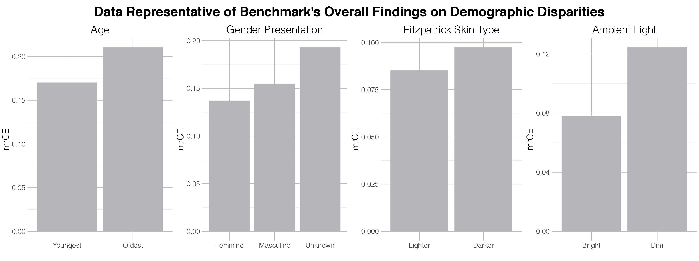

# Robustness Disparities in Commercial Face Detection



Facial detection and analysis systems have been deployed by large companies and critiqued by scholars and activists for the past decade. Critiques that focus on system performance analyze disparity of the system's output, i.e., how frequently is a face detected for different Fitzpatrick skin types or perceived genders. However, we focus on the robustness of these system outputs under noisy natural perturbations. We present the first of its kind detailed benchmark of the robustness of two such systems: Amazon Rekognition and Microsoft Azure. Using both standard and recently released academic facial datasets, we find that photos of individuals who are _older_, _masculine presenting_, of _darker skin type_, or have _dim lighting_ are more susceptible to errors than their counterparts in other identities.

## About the Benchmark

This benchmark uses four datasets to evaluate the robustness of Amazon AWS and Microsoft Azure’s face detection systems to natural types of noise.
* **[Adience](https://talhassner.github.io/home/projects/Adience/Adience-data.html)**
* **[Casual Conversations Dataset (CCD)](https://ai.facebook.com/datasets/casual-conversations-dataset/)**
* **[Open Images V6 -- Extended; More Inclusive Annotations for People (MIAP)](https://storage.googleapis.com/openimages/web/extended.html)**
* **[UTKFace](https://susanqq.github.io/UTKFace/)**

For a subset of the images in this dataset, we created 75 corrupted versions following the [ImageNet-C](https://github.com/hendrycks/robustness) pipeline.  

Subsequently, each image (1 clean + 75 corrupted images) was passed through Amazon Web Services's [Rekognition](https://docs.aws.amazon.com/rekognition/latest/dg/API_DetectFaces.html) and Microsoft [Azure](https://westus.dev.cognitive.microsoft.com/docs/services/563879b61984550e40cbbe8d/operations/563879b61984550f30395236) face detection APIs.

## About this Repo

We conducted the entire benchmark using AWS's S3 and EC2 infrastructure. The image datasets were downloaded to an S3 bucket, processed/corrupted using EC2 instances (primarily `c5.large`), and then passed through each API using EC2 instances (`i3.xlarge`) and storing responses in an S3 bucket. This process was specific to our choices, though any compute environment could be used to reproduce these results. To that end, we will include the essential code used to process the images and make the API calls, and do not include specific and superfluous data management scripts which would be idiosyncratic to the specific process we chose.

# Steps

## 1) Download the images

The download links for the images are included above. The download and extraction of the images from Adience, MIAP, and UTKFace are straightforward.

The CCD dataset is broken into >30 zip files, each around 100GBs. Unfortunately, they are not organized neatly and we had to download all the files and unzip them. The CCD dataset contains videos and not images. In order to turn them into images, we used [ffmpeg](https://ffmpeg.org/). Once all the video files are extracted, create a file `mp4_files.txt` that contains a list of the movies you want to extract frames for. Then run
```bash
sh ./video_extract_frame.sh mp4_files.txt
```

## 2) Select which images to incldue in the benchmark

Once all the clean images are downloaded and read, create a file which has all the image locations for those which you would like to corrupt. We followed a procedure to corrupt just a subset of the images in the four datasets. We chose no more than 1,500 images from each intersectional identity for each dataset. You can obtain a list like this by using the dataload objects included in `datasets.py` to load in the image metadata and then running the `select_unique_id` method to get the desired sample of images. Here is an example for the Adience dataset:

```python
from datasets import *
adience = adience_dataset()
adience.load_metadata()
adience.select_unique_ids()
```

The images that we used for our benchmark can be found in the `./data/` folder.

## 3) Corrupt the images

We used the ImageNet-C procedures to corrupt each image. The ImageNet-C code is designed for images which are `244x244` pixels -- much smaller than the images in our benchmark. To account for this, we have included in the folder `./code/imagenet_c_big/` a modified version of that code which removes the 244 assumption.

First create a list of the images you'd like to corrupt in a file; we'll call it `images_to_corrupt.txt`. Then call the `distort.py` file. You have the options to download the images in your list (if they are an S3 bucket) or not if they are local images. You also have the option to upload the corrupted images to S3 if you'd like. The default command is:
```bash
python3 distort.py images_to_corrupt.txt
```

## 4) Make API calls

Now that you have all your corrupted images, it is time to send the images to AWS and Azure to get their face detections.

First get a list of all the images you'd like to send to the services; we'll call it `images_to_detect.txt`. Then call the `detect_faces.py` file. This script assumes that each image is in an S3 bucket for faster processing. If you wanted to process every image in your file with AWS Rekognition, you'd run the following command:
``` bash
python3 detect_faces.py images_to_detect.txt aws
```
This will save one json for each image and response. The json is structured like this example:
```
{
  'original_photo': 'path/to/original_photo.png,
  'photo': 'original_photo.png',
  'corruption': 'gaussian-noise,
  'severity': 4,
  'service': 'aws',
  'response':
          ...
}
```

# Citation
```
@article{dooley2020robustness,
  title={Robustness Disparities in Commercial Face Detection},
  author={Dooley, Samuel and Goldstein, Thomas and Dickerson, John P.},
  journal={Working Paper},
  year={2021}
}
```

# Contact

If you'd like more information, get in [contact with us](mailto:sdooley1@cs.umd.edu)! Happy to share more details or data or answer questions.
